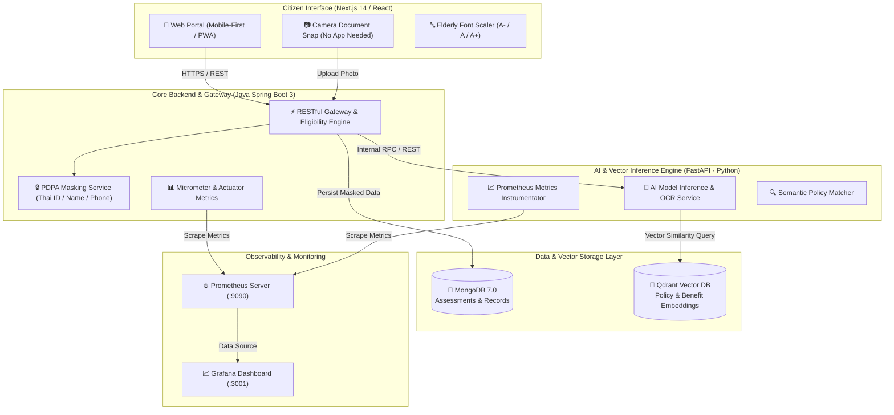

# 🏥 CarePulse AI - ระบบประเมินสิทธิการรักษาพยาบาลและการจัดการข้อมูลอัจฉริยะ (Enterprise Microservices)

ระบบแพลตฟอร์มประเมินสิทธิการรักษาพยาบาลและสิทธิประโยชน์สุขภาพอัจฉริยะ (บัตรทอง 30 บาทรักษาทุกที่, ประกันสังคม ม.33/39/40, ข้าราชการ CSMBS, สิทธิผู้สูงอายุ และคนพิการ) สถาปัตยกรรมระดับ **Enterprise Microservices** ที่ผสานการทำงานระหว่าง **Java Spring Boot**, **FastAPI (Python AI)**, **Next.js (React)**, **MongoDB**, **Vector Database**, **Kubernetes**, **CI/CD GitHub Actions**, และระบบติดตามสถานะแบบ Real-time ด้วย **Prometheus & Grafana**

---

## 🏗️ สถาปัตยกรรมระบบ Microservices (System Architecture)



---

## 📁 โครงสร้างโปรเจกต์ (Project Structure)

```text
CarePulse-AI/
├── backend-spring-boot/          # ☕ Core Backend & Eligibility Engine (Java 17 / Spring Boot 3)
│   ├── src/main/java/com/carepulse/
│   │   ├── client/               # FastAPI AI Client (HTTP RestClient)
│   │   ├── controller/           # REST API Controllers (Eligibility & Document proxy)
│   │   ├── model/                # AssessmentRequest, Response & MongoDB Entities
│   │   ├── repository/           # Spring Data MongoDB Repository
│   │   ├── service/              # Rules Engine (สิทธิบัตรทอง/ประกันสังคม/ข้าราชการ) & PDPA Masking
│   │   └── CarePulseApplication.java
│   ├── src/main/resources/application.yml  # Config + Actuator Prometheus exposure
│   ├── pom.xml
│   └── Dockerfile
│
├── backend/                      # 🐍 AI Model Inference & OCR Engine (Python 3.11 / FastAPI)
│   ├── app/
│   │   ├── api/v1/endpoints/     # OCR & Semantic Vector RAG APIs
│   │   ├── core/                 # PDPA Sanitizer & Configs
│   │   ├── db/                   # Qdrant Vector DB & Mongo connectors
│   │   ├── services/             # OCR Preprocessing & Embedding Engine
│   │   └── main.py               # FastAPI + Prometheus Instrumentator
│   ├── Dockerfile
│   └── requirements.txt
│
├── frontend/                     # ⚛️ Citizen User Interface (Next.js 14 / Tailwind CSS)
│   ├── src/
│   │   ├── app/                  # App Router (Home, Scan, Assessment, Results)
│   │   ├── components/           # CameraCapture, FontScaler (A-/A/A+), EligibilityCard
│   │   └── lib/api.ts            # API Client
│   ├── Dockerfile
│   └── package.json
│
├── k8s/                          # ☸️ Kubernetes Production Manifests
│   ├── namespace.yaml
│   ├── spring-boot-deployment.yaml  # Deployment + Service + HPA (Auto-scaling)
│   ├── fastapi-ai-deployment.yaml   # AI Inference Deployment + Service
│   ├── frontend-deployment.yaml     # Next.js Deployment + Ingress SSL/TLS
│   └── ingress.yaml
│
├── monitoring/                   # 📊 Real-time Monitoring & Observability
│   ├── prometheus/prometheus.yml    # Scrape configuration for Spring Boot & FastAPI
│   └── grafana/                     # Provisioned Dashboards & Prometheus Data Source
│
├── .github/workflows/            # 🚀 CI/CD Automated Pipeline
│   └── ci-cd.yml                 # Build, Test (Maven/Pytest/Next.js), Docker Push & K8s Dry-run
│
├── docker-compose.yml            # รันระบบครบวงจร (7 Services)
└── README.md
```

---

## 🔒 ฟีเจอร์ความปลอดภัย & PDPA (Security & Compliance)

1. **Automatic Data Masking (On-the-Fly)**:
   - **เลขประจำตัวประชาชน 13 หลัก**: เซนเซอร์เป็น `1-1004-XXXXX-XX-3`
   - **ชื่อ-นามสกุล**: เซนเซอร์เป็น `สม*** ใจ**`
   - **หมายเลขโทรศัพท์**: เซนเซอร์เป็น `081-XXX-5678`
2. **On-Premise / Secure Cloud Compliant**:
   - ระบบประมวลผลภายใน Private Network / Cluster ไม่มีข้อมูลสุขภาพรั่วไหลออกไปยัง External API

---

## 📊 ระบบติดตามสถานะแบบ Real-time (Observability)

- **Prometheus** (`:9090`): ดึง Metrics จาก Spring Boot Actuator (`/actuator/prometheus`) และ FastAPI (`/metrics`)
- **Grafana** (`:3001`): แสดงผล Real-time Throughput, AI Model Latency, JVM Heap Memory และ Request Status Codes

---

---

## 🤖 ระบบ AI LLM บน Modal Cloud GPU (Qwen 3.8 27B FP8)

ระบบเชื่อมต่อกับโมเดลประมวลผลภาษาธรรมชาติ **Qwen3.8-27B-FP8** ผ่าน **Modal GPU Infrastructure** โดยใช้ **vLLM (OpenAI-compatible Server)** พร้อม Tensor Parallelism บน Dual A10G GPUs:

- **Modal Endpoint**: `https://netnaphat0305--carepulse-qwen-38-27b-serve.modal.run`
- **OpenAI Compatible Base URL**: `https://netnaphat0305--carepulse-qwen-38-27b-serve.modal.run/v1`
- **Deployment Script**: [modal_qwen.py](file:///Users/netnaphat/Desktop/CDG/CarePulse-AI/modal_qwen.py)
- **AI Endpoints**:
  - `POST /api/v1/ai/chat`: ปรึกษาสิทธิประโยชน์และการรักษาพยาบาลร่วมกับ Semantic RAG
  - `POST /api/v1/ai/explain`: สร้างคำอธิบายสรุปสิทธิและข้อปฏิบัติเฉพาะบุคคล
  - `GET /api/v1/ai/status`: ตรวจสอบสถานะการเชื่อมต่อไปยัง Modal GPU LLM

---

## 🚀 วิธีการติดตั้งและรันระบบ (Quick Start)

### 1. รันด่วนในเครื่องแบบ Local Development (FastAPI + Next.js)

```bash
./start_local.sh
```

- **Citizen Interface**: [http://localhost:3000](http://localhost:3000) (พร้อม Floating AI Chatbot Qwen 3.8)
- **FastAPI Backend Swagger**: [http://localhost:8000/docs](http://localhost:8000/docs)
- **AI Health Status**: [http://localhost:8000/api/v1/ai/status](http://localhost:8000/api/v1/ai/status)

---

### 2. ดีพลอย / อัปเดตโมเดลบน Modal

```bash
# ติดตั้ง Modal token
modal token set --token-id <TOKEN_ID> --token-secret <TOKEN_SECRET> --profile=netnaphat0305

# สั่ง Deploy vLLM Qwen3.8-27B-FP8 ขึ้น Modal
modal deploy modal_qwen.py
```

---

### 3. รันครบทั้ง 7 Services ด้วย Docker Compose

```bash
docker compose up --build
```

| Service | URL / Port | รายละเอียด |
| :--- | :--- | :--- |
| **Citizen Interface** | [http://localhost:3000](http://localhost:3000) | หน้าเว็บประชาชน/ผู้สูงอายุ ถ่ายรูปเอกสาร |
| **Spring Boot Core API** | [http://localhost:8080](http://localhost:8080) | Gateway & คำนวณสิทธิการรักษา |
| **FastAPI AI Docs** | [http://localhost:8000/docs](http://localhost:8000/docs) | AI Model Inference & OCR Engine |
| **Grafana Dashboards** | [http://localhost:3001](http://localhost:3001) | Dashboard ตรวจสอบสถานะระบบ (admin/admin) |
| **Prometheus** | [http://localhost:9090](http://localhost:9090) | Metrics Server |
| **Qdrant Vector DB** | [http://localhost:6333/dashboard](http://localhost:6333/dashboard) | Vector Database Console |
| **MongoDB** | `localhost:27017` | Document Database |

---

### 4. ติดตั้งขึ้น Kubernetes Cluster

```bash
kubectl apply -f k8s/namespace.yaml
kubectl apply -f k8s/spring-boot-deployment.yaml
kubectl apply -f k8s/fastapi-ai-deployment.yaml
kubectl apply -f k8s/frontend-deployment.yaml
```

